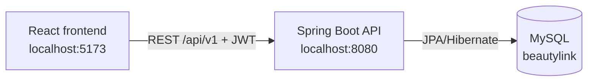

# BeautyLink


BeautyLink is a full-stack marketplace that connects customers with third-party beauty providers such as makeup artists, hair salons, nail studios, spas, massage centers, and skincare clinics.

> Project status: the main discovery, authentication, scheduling, booking, supplier, and support flows are functional. Payments are intentionally simulated and do not charge real money.

## Features

### Guest and customer

- Choose between Hà Nội and Thành phố Hồ Chí Minh.
- Browse database-backed service categories and providers.
- Search services, view prices, ratings, availability, and practitioners.
- Register or sign in with JWT authentication.
- Book an available appointment and view it in **Tổng quan & Lịch hẹn**.
- Cancel eligible appointments and submit support reports.

### Supplier

- Register a supplier business. Local development auto-verifies it for demonstrations; production keeps it `PENDING` until approval.
- Access a supplier dashboard.
- Upload a store thumbnail and practitioner avatar images.
- Create, edit, publish, hide, and categorize store services.
- Manage practitioners and their weekly working hours, breaks, and slot duration.
- View appointments made with that supplier.

### Staff and admin

- View customer reports.
- Move reports through open, in-review, resolved, or rejected states.
- Record resolution notes and the assigned staff member.

### Demo catalog

- Five categories: makeup, hair, spa, nails, and skincare.
- Demo suppliers and services for both supported cities.
- Demo suppliers are marked with `suppliers.demo_data = TRUE` for safe identification and later cleanup.
- Demo practitioners have working schedules, so the booking flow can be demonstrated end to end.

## Technology stack

| Layer | Technology |
|---|---|
| Frontend | React 19, TypeScript, Vite 6, Tailwind CSS 4 |
| Client state/API | React hooks, Axios, localStorage persistence |
| Backend | Java 21, Spring Boot 3.5, Spring Web |
| Authentication | Spring Security, JWT, BCrypt |
| Persistence | Spring Data JPA, Hibernate |
| Database | MySQL 8 |
| Tests | JUnit 5, Spring MockMvc, H2 in MySQL compatibility mode |
| Deployment configuration | Vercel for `frontend`, Railway/Docker for `backend` |

## Architecture



During local development, Vite proxies `/api` requests to Spring Boot. In deployment, `VITE_API_BASE_URL` points the frontend to the public backend URL.

## Prerequisites

Install these before starting:

- Git
- Node.js 20 or newer and npm
- Java Development Kit 21
- Maven 3.9 or newer (`mvn` must be available in the terminal)
- MySQL Server 8

Check the installations:

```powershell
git --version
node --version
npm --version
java --version
mvn --version
mysql --version
```

## Local setup

### 1. Clone the repository

```powershell
git clone <YOUR_GITHUB_REPOSITORY_URL>
cd BeautyLink
```

### 2. Start MySQL

On Windows, the default service is commonly named `MySQL80`. Run PowerShell as Administrator:

```powershell
Start-Service MySQL80
```

If that service name does not exist, find the installed name:

```powershell
Get-Service *mysql*
```

On macOS with Homebrew:

```bash
brew services start mysql
```

On Linux with systemd:

```bash
sudo systemctl start mysql
```

### 3. Create the database

Open MySQL:

```powershell
mysql -u root -p
```

Then run:

```sql
CREATE DATABASE IF NOT EXISTS beautylink
  CHARACTER SET utf8mb4
  COLLATE utf8mb4_unicode_ci;
```

Exit with `exit;`.

Only the database itself must be created manually. Hibernate creates and updates the application tables when the backend starts.

### 4. Configure the backend

Copy the safe example file:

```powershell
Copy-Item backend/.env.properties.example backend/.env.properties
```

Open `backend/.env.properties` and enter local values:

```properties
MYSQL_URL=jdbc:mysql://localhost:3306/beautylink?useSSL=false&allowPublicKeyRetrieval=true&serverTimezone=Asia/Bangkok&characterEncoding=UTF-8
MYSQL_USERNAME=your_mysql_username
MYSQL_PASSWORD=your_mysql_password
JWT_SECRET=replace-with-a-long-random-secret-of-at-least-32-characters
JWT_EXPIRATION_MS=86400000
CORS_ALLOWED_ORIGINS=http://localhost:5173,http://127.0.0.1:5173
SUPPLIER_AUTO_VERIFY=true
```

`backend/.env.properties` is ignored by Git. Never commit this file or paste production secrets into source code.

### 5. Install the frontend dependencies

```powershell
cd frontend
npm install
cd ..
```

The frontend does not need a local environment file because Vite proxies `/api` to port `8080`. To use a backend on another host, copy `frontend/.env.example` to `frontend/.env.local` and set `VITE_API_BASE_URL`.

## Run the application

Use two terminals.

Terminal 1 — backend:

```powershell
cd backend
mvn spring-boot:run
```

Wait for `Tomcat started on port 8080`.

Terminal 2 — frontend:

```powershell
cd frontend
npm run dev
```

Open these URLs:

- Website: <http://localhost:5173>
- Backend API: <http://localhost:8080/api/v1/categories>

Stop either server with `Ctrl+C` in its terminal.

## Demo accounts

All built-in demo accounts use the password `Demo123!`.

| Role | Phone | Email |
|---|---|---|
| Customer | `0900000001` | `customer@beautylink.vn` |
| Supplier | `0900000002` | `supplier@beautylink.vn` |
| Staff | `0900000003` | `staff@beautylink.vn` |
| Admin | `0900000004` | `admin@beautylink.vn` |

Guests do not have database accounts. They can browse the catalog but must register or sign in before booking.

## Main user flows

### Make a booking

1. Choose Hà Nội or Thành phố Hồ Chí Minh.
2. Open a category or service.
3. Select a service, practitioner, date, and available time.
4. Sign in as a customer when prompted.
5. Confirm the simulated payment and booking.
6. Open the customer account page or `#bookings` to see the appointment.

### Configure a supplier schedule

1. Sign in with the supplier demo account.
2. Open the supplier dashboard.
3. Select a practitioner.
4. Configure working days, opening/closing time, break, and slot length.
5. Save the schedule. Customer availability updates from the stored rules.

### Configure a supplier store

1. Register or sign in with a supplier account.
2. Open **Gian hàng & dịch vụ** in the supplier dashboard.
3. Upload the store thumbnail and save the business profile.
4. Select **Tạo dịch vụ**, choose a category, enter the price and duration, and upload a service image.
5. Save the active service. In local demo mode, manually created suppliers are shown before seeded suppliers on the homepage.

Uploaded JPG, PNG, and WEBP files are resized in the browser and stored with the related MySQL record. The original file limit is 10 MB.

### Process a report

1. A customer submits a report from an eligible page.
2. Sign in as staff or admin.
3. Open the reports workspace.
4. Change the status and enter a resolution note.

## Database design

The main tables are:

| Table | Purpose |
|---|---|
| `user_accounts` | Login identity, password hash, role, account status |
| `locations` | Cities and optional district/ward hierarchy |
| `suppliers` | Provider business profile and verification state |
| `service_categories` | Stable category definitions |
| `service_offerings` | Supplier services, price, duration, category, and image |
| `practitioners` | People who perform services for a supplier |
| `availability_rules` | Recurring weekly working hours and breaks |
| `schedule_exceptions` | Date-specific schedule overrides |
| `bookings` | Customer, supplier, service, practitioner, time, and status |
| `support_reports` | Customer reports and staff resolutions |

Categories are intentionally connected through `service_offerings.category_id`. A supplier can therefore offer services in multiple categories without storing a duplicate category list on the supplier row.

The unique booking constraint on practitioner, date, and start time prevents double-booking the same slot.

## API summary

All application endpoints use the `/api/v1` prefix.

| Area | Important endpoints |
|---|---|
| Authentication | `POST /auth/register`, `POST /auth/login`, `GET /auth/me` |
| Supplier registration | `POST /auth/register-supplier` |
| Catalog | `GET /locations`, `GET /categories`, `GET /categories/{slug}/services` |
| Availability | `GET /services/{serviceId}/availability` |
| Customer bookings | `POST /bookings`, `GET /bookings/mine`, `PATCH /bookings/{id}/cancel` |
| Supplier workspace | `GET/PUT /supplier/profile`, practitioner and schedule endpoints |
| Supplier services | `GET/POST /supplier/services`, `PUT/DELETE /supplier/services/{id}` |
| Supplier bookings | `GET /bookings/supplier` |
| Support | `POST /reports`, staff/admin `GET` and `PATCH /reports` |

Protected requests send the JWT as:

```text
Authorization: Bearer <access-token>
```

## Seed data

Development startup seeders run outside the `prod` Spring profile:

- Core accounts, locations, categories, and the first supplier are inserted into an empty catalog.
- The presentation catalog is idempotently inserted or updated on later starts.
- Demo suppliers are marked with `demo_data = TRUE`.
- Both supported cities have services in every category.

Inspect demo suppliers:

```sql
SELECT id, name, slug, demo_data
FROM suppliers
WHERE demo_data = TRUE;
```

To remove presentation records later, review and manually run:

```text
backend/src/main/resources/db/demo-data-cleanup.sql
```

That cleanup script deletes demo bookings and dependent records, so do not run it against valuable demonstration data without checking it first.

## Testing and verification

Backend integration tests:

```powershell
cd backend
mvn test
```

Frontend type checking:

```powershell
cd frontend
npm run lint
```

Frontend production build:

```powershell
cd frontend
npm run build
```

The backend tests use an in-memory H2 database and do not modify the local MySQL database.

## Project structure

```text
BeautyLink/
├── backend/
│   ├── src/main/java/com/example/backend/
│   │   ├── auth/          # JWT and authenticated account loading
│   │   ├── bootstrap/     # Development and demo database seeders
│   │   ├── config/        # Security and CORS
│   │   ├── controller/    # REST endpoints
│   │   ├── dto/           # API request/response records
│   │   ├── model/         # JPA entities and enums
│   │   ├── repository/    # Spring Data repositories
│   │   └── service/       # Business rules
│   ├── src/main/resources/
│   ├── src/test/          # Integration tests
│   ├── Dockerfile
│   └── railway.json
├── frontend/
│   ├── public/            # Public assets
│   ├── src/components/    # Pages, sections, dialogs, dashboards
│   ├── src/lib/           # API and shared utilities
│   ├── src/services/      # Backend service wrappers
│   ├── src/store/         # Persistent client state
│   ├── src/types/         # Shared frontend types
│   └── vercel.json
├── Project Requirement.txt
└── README.md
```

`frontend-legacy-20260925` and `frontend-node-modules-incomplete-20260925` are local backup folders and are not the active application.

## Deployment overview

### Frontend on Vercel

1. Import the GitHub repository into Vercel.
2. Set the root directory to `frontend`.
3. Use `npm run build` and output directory `dist`.
4. Set `VITE_API_BASE_URL` to the deployed backend URL ending in `/api`.

### Backend on Railway

1. Deploy from the `backend` directory using its Dockerfile/Railway configuration.
2. Provision a MySQL database.
3. Set `MYSQL_URL` to a valid JDBC MySQL URL.
4. Set `MYSQL_USERNAME`, `MYSQL_PASSWORD`, and a new production `JWT_SECRET`.
5. Set `CORS_ALLOWED_ORIGINS` to the exact Vercel website origin.
6. Set `SPRING_PROFILES_ACTIVE=prod` when demo seeders must be disabled.
7. Keep `SUPPLIER_AUTO_VERIFY=false` so new partners require approval in production.

Do not use the demo passwords or development JWT secret in production.

## Troubleshooting

### `Access denied for user` or backend fails during startup

- Confirm MySQL is running.
- Confirm `beautylink` exists.
- Check `MYSQL_USERNAME` and `MYSQL_PASSWORD` in `backend/.env.properties`.
- Test the same credentials with `mysql -u <username> -p`.

### `NetworkError`, `ERR_CONNECTION_REFUSED`, or products/services do not load

- Confirm Spring Boot is still running on port `8080`.
- Open <http://localhost:8080/api/v1/categories> directly.
- Confirm Vite is running on port `5173`.
- For deployment, verify `VITE_API_BASE_URL` and `CORS_ALLOWED_ORIGINS`.

### Port already in use

On Windows:

```powershell
Get-NetTCPConnection -LocalPort 8080,5173 -ErrorAction SilentlyContinue
```

Stop the old development process or change the appropriate port configuration.

### A category appears empty

- Confirm the selected city.
- Check that the supplier is `VERIFIED`.
- Check that its service offering is active and references the expected category.

### Images fail to load

The frontend displays a local BeautyLink placeholder when an external supplier image is unavailable. Replace stale remote URLs with owned or properly licensed production assets before launch.

## Security notes

- Passwords are BCrypt hashes; plaintext passwords are never stored.
- JWT-protected endpoints enforce customer, supplier, staff, or admin roles.
- Secrets remain in ignored environment files.
- Supplier data is public only after verification. `SUPPLIER_AUTO_VERIFY=true` is intended only for local demonstrations.
- Real payment processing is not implemented yet.

## Contributing

1. Create a feature branch from the current main branch.
2. Keep changes focused and do not commit secrets, `node_modules`, `dist`, or `target`.
3. Run the backend tests and frontend checks.
4. Open a pull request explaining the change and how it was tested.

## License

No open-source license has been selected. Unless the project owner adds one, the source remains under the owner's default copyright rights.
